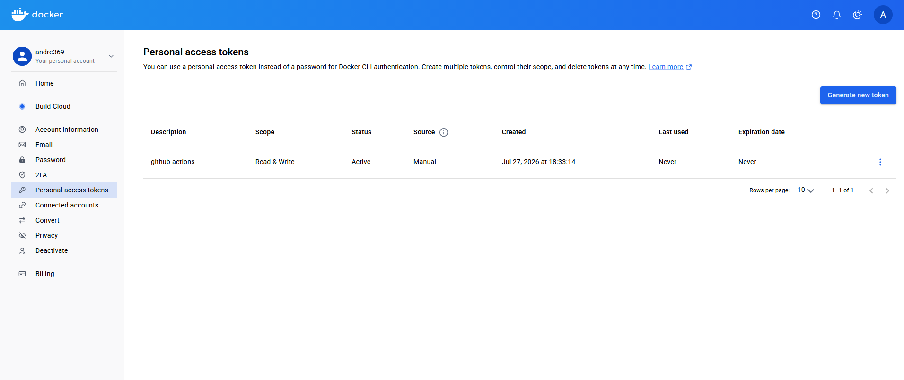
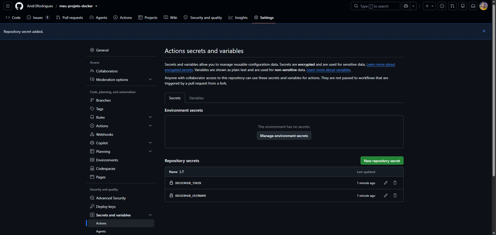
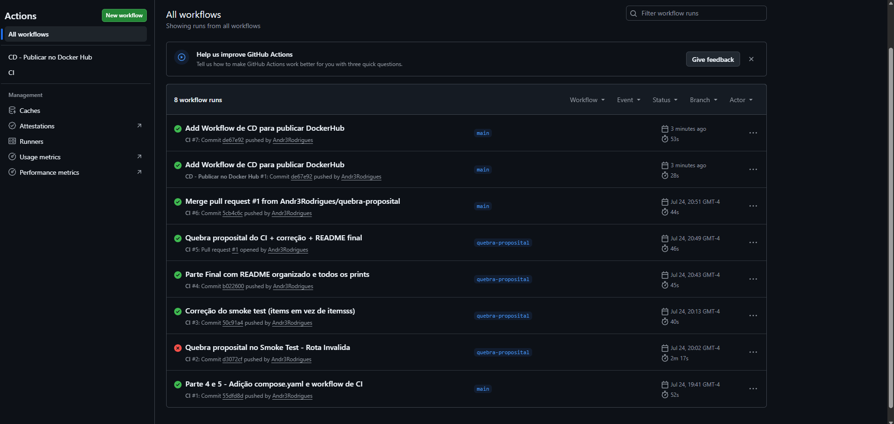
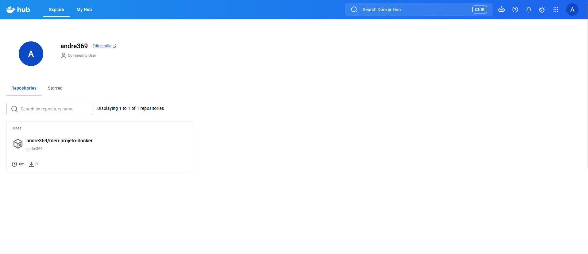
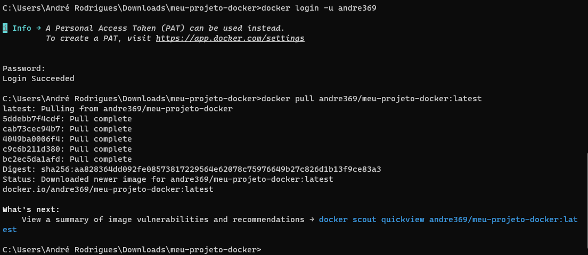
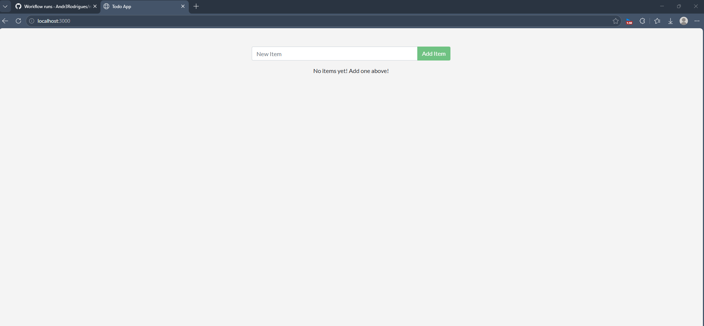
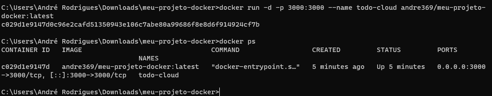

Aluno(a): André da Silva Rodrigues
Turma: ITEAM - Noturno
Data: 24/07/2026
Aplicação usada: docker/getting-started-app — To-Do em Node.js

## 1. Como executar este projeto

```bash
git clone https://github.com/Andr3Rodrigues/meu-projeto-docker.git
cd meu-projeto-docker
cp .env.example .env
docker compose up -d --build
```

Acesse: http://localhost:3000

Para derrubar: `docker compose down` (mantém dados) ou `docker compose down -v` (apaga dados).

## 2. Imagem e Dockerfile multi-stage

Estágios utilizados: `builder` (instala as dependências com `npm install`) e o estágio final (runtime enxuto, só com `node_modules` + código-fonte).
Imagem base: `node:20-alpine`
Usuário de execução: `appuser`, não-root
Tamanho final da imagem: 238MB (disk usage) / 58,2MB (content size)

Por que o multi-stage ajuda? O estágio de build pode conter ferramentas e arquivos temporários usados só para instalar dependências, mas a imagem final leva apenas o `node_modules` e o código já prontos — isso reduz o tamanho da imagem e a superfície de ataque, já que nada do processo de build fica exposto no container em produção.

Print 1 — build + `docker images`


Print 2 — aplicação rodando com tarefas cadastradas


## 3. Volumes e persistência

Volume usado: `todo-db` (execução avulsa) / `todo-mysql-data` (compose) → montado em `/etc/todos` (SQLite) ou `/var/lib/mysql` (MySQL)

Print 3 — SEM volume: dados perdidos ao recriar o container


Print 4 — COM volume: dados preservados
!

Diferença entre `docker compose down` e `docker compose down -v`: o primeiro remove containers e rede mas mantém os volumes (dados preservados); o segundo remove também os volumes, mas apagando os dados do banco.

## 4. Rede

Rede criada: `todo-net`
Serviços conectados: `app` e `db`
A porta do banco está exposta ao host? Não — o serviço `db` não tem `ports:` no compose.yaml, apenas está na rede interna `todo-net`, então só o serviço `app` consegue acessá-lo.

Por que o app consegue chamar o host `mysql` / `db` sem saber o IP? Porque o Docker fornece um DNS interno para cada rede definida por usuário: cada container é resolvido pelo nome do serviço (ou pelo `--network-alias`), então o app só precisa apontar `MYSQL_HOST=mysql` (ou `db`, no Compose) e o Docker resolve isso para o IP correto internamente.

Print 5 — `docker network inspect`


Print 6 — dados dentro do MySQL (`select * from todo_items;`)


## 5. Docker Compose

Serviços: `app`, `db`
Rede: `todo-net` · Volume: `todo-mysql-data`
Healthcheck em: `db` · `depends_on` com: `condition: service_healthy`
Variáveis sensíveis: carregadas via `.env` (não versionado). Modelo em `.env.example`.

Print 7 — `docker compose ps`


## 6. Integração Contínua (GitHub Actions)

Arquivo do workflow: `.github/workflows/ci.yml`
Gatilhos: `push` e `pull_request`
O que o pipeline faz:
1. Valida o `compose.yaml` (`docker compose config`)
2. Builda a imagem do serviço `app`
3. Sobe a stack (`docker compose up -d`)
4. Aguarda a app responder e testa criar uma tarefa via API (smoke test)
5. Derruba a stack (`docker compose down -v`)

Print 8 — execução verde
 

## 7. Quebra proposital do CI

O que eu quebrei: troquei a rota `/items` por `/itemsss` (inexistente) no step "Aguardar a aplicação responder" do workflow de CI.
Erro que apareceu no log: `A aplicacao nao subiu a tempo`, seguido de `exit 1`, porque o `curl -sf` para `/itemsss` retornava erro em todas as 30 tentativas.
Como o CI reagiu: o pipeline parou no step "Aguardar a aplicação responder", antes de chegar ao smoke test, evitando que um erro de rota passasse despercebido.
Como eu corrigi: segui a indicaçã do material e voltei a URL para `/items`, fiz commit e push na mesma branch (`quebra-proposital`), e o mesmo Pull Request passou a ficar verde.

Link do Pull Request: [cole aqui a URL do seu PR]

Print 9 — execução vermelha + log do erro


## 8. Dificuldades e aprendizados

Durante a atividade enfrentei alguns bloqueios de ambiente no Windows: o Firewall bloqueou o Docker inicialmente e precisei liberar via linha de comando; o grupo `docker-users` não tinha sido criado na instalação e precisei reparar o Docker Desktop; e na Parte 4 o Compose entrou em conflito com uma rede `todo-net` criada manualmente na Parte 3, resolvido removendo a rede antiga antes do `docker compose up`. 
A atividade deixou mais claro como containers, redes e volumes são recursos independentes do processo da aplicação, e como pequenos detalhes de permissão de usuário dentro da imagem afetam a execução.

## 9. Checklist de autoavaliação

- [x] Dockerfile multi-stage funcionando
- [x] .dockerignore presente
- [x] Container não roda como root
- [x] Volume nomeado + persistência demonstrada
- [x] Rede nomeada + banco não exposto ao host
- [x] compose.yaml sobe tudo com um comando
- [x] .env no .gitignore e .env.example versionado
- [x] CI verde
- [x] PR com CI vermelho documentado
- [x] Todos os 9 prints no README

## Evidências complementares

Prints adicionais tirados durante o processo (não obrigatórios, mas documentam cada etapa em detalhe):


## CD — Publicação no Docker Hub

Aluno(a): André da Silva Rodrigues
Turma: ITEAM - Noturno
Usuário do Docker Hub: andre369
Imagem publicada: andre369/meu-projeto-docker:latest
Link da imagem no Docker Hub: https://hub.docker.com/r/andre369/meu-projeto-docker

Dispara quando: push na branch main
Arquivo do workflow: .github/workflows/cd.yml

Print 1 — token criado no Docker Hub


Print 2 — Secrets cadastrados no GitHub


Print 3 — workflow de CD verde na aba Actions


Print 4 — imagem publicada no Docker Hub


Print 5 — docker pull baixando a imagem publicada


Print 5.1


Print 5.2



### Respostas

1. **O que é o Docker Hub?** É um repositório central na nuvem para imagens Docker — digamos que é como um "GitHub de imagens", onde qualquer pessoa pode publicar ou baixar imagens prontas para rodar em qualquer máquina com Docker instalado.

2. **Diferença entre CI e CD:** o CI (Integração Contínua) testa automaticamente se o código funciona a cada push, validando o build e a aplicação. O CD (Entrega Contínua) tem um papel que vai além: depois que o código passa nos testes, ele constrói e publica a imagem final num lugar acessível (o Docker Hub), automatizando também a entrega, não só a verificação.

3. **Por que usar token e Secrets em vez de usuário/senha no cd.yml?** Porque o arquivo `cd.yml` fica público no repositório — qualquer credencial escrita ali ficaria visível para qualquer pessoa. Os Secrets do GitHub guardam esses valores de forma criptografada e só os injetam durante a execução do workflow, sem expor o valor em nenhum lugar do código. O token, além disso, tem permissão limitada e pode ser revogado a qualquer momento sem precisar trocar a senha da conta.

4. **O que significa a tag `latest`?** É a versão "mais recente" da imagem — quando ninguém especifica uma versão numerada (ex.: `v1.0`), o Docker assume `latest` como padrão. Toda vez que o CD publica uma nova imagem sem trocar a tag, ela substitui a `latest` anterior.